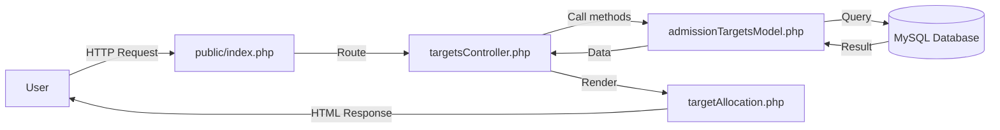

# 🎯 Phân bổ chỉ tiêu tuyển sinh - Admission Targets Allocation

> **Hệ thống quản lý phân bổ chỉ tiêu tuyển sinh cho 11 trường THPT tại Thành phố Hồ Chí Minh**

[](https://www.php.net/)
[](https://www.mysql.com/)
[](LICENSE)

---

## 📋 Mục lục

1. [Tổng quan](#-tổng-quan)
2. [Tính năng chính](#-tính-năng-chính)
3. [Cấu trúc dự án](#-cấu-trúc-dự-án)
4. [Kiến trúc MVC](#-kiến-trúc-mvc)
5. [Thuật toán phân bổ](#-thuật-toán-phân-bổ)
6. [Database Schema](#-database-schema)
7. [Hướng dẫn cài đặt](#-hướng-dẫn-cài-đặt)
8. [Hướng dẫn sử dụng](#-hướng-dẫn-sử-dụng)
9. [API Reference](#-api-reference)
10. [Validation Rules](#-validation-rules)
11. [Troubleshooting](#-troubleshooting)
12. [Roadmap](#-roadmap)

---

## 🌟 Tổng quan

### Mô tả

Chức năng **Phân bổ chỉ tiêu tuyển sinh** cho phép Nhân viên Sở Giáo dục & Đào tạo phân bổ số lượng học sinh tuyển sinh cho 11 trường THPT dựa trên:

- 📊 Dữ liệu năm trước (2023-2024 là năm gốc cố định)
- 📈 Thuật toán weighted average với 4 yếu tố
- 🎓 Số lượng học sinh hiện tại của từng trường
- 🏫 Năng lực và quy mô của trường

### Đặc điểm nổi bật

✅ **Năm gốc cố định** - 2023-2024 với tổng 8,000 chỉ tiêu không thể sửa  
✅ **Gợi ý thông minh** - Tính toán tự động dựa trên 4 yếu tố trọng số  
✅ **Validation 3 lớp** - HTML5, JavaScript real-time, PHP server-side  
✅ **Visual feedback** - Màu sắc trực quan (đỏ/vàng/xanh)  
✅ **Transaction ACID** - Đảm bảo tính toàn vẹn dữ liệu  
✅ **Responsive UI** - Giao diện thân thiện trên mọi thiết bị  

---

## 🎯 Tính năng chính

### 1. Quản lý năm học
- Hiển thị danh sách năm học từ 2023-2024 đến 2026-2027
- Khóa năm gốc 2023-2024 (chỉ xem, không sửa)
- Chuyển đổi năm học dễ dàng

### 2. Phân bổ chỉ tiêu
- Nhập chỉ tiêu cho 11 trường THPT
- Tự động tính tổng và kiểm tra
- Hiển thị % phân bổ cho từng trường
- Cảnh báo nếu tổng không khớp

### 3. Gợi ý thông minh
- Tính toán dựa trên 4 yếu tố với trọng số khác nhau
- Làm tròn đến bội số 50 để dễ quản lý
- Giới hạn min=100, max=2,000 cho mỗi trường

### 4. Validation đa lớp
- **Lớp 1 (HTML5):** `min="1"`, `step="1"`, `required`
- **Lớp 2 (JavaScript):** Real-time với auto-clear sau 500ms
- **Lớp 3 (PHP):** Server-side validation cuối cùng

### 5. Lịch sử phân bổ
- Xem 5 lần phân bổ gần nhất
- Thông tin: năm học, ngày, số trường, tổng chỉ tiêu

---

## 📁 Cấu trúc dự án

```
Learning-Systems/
│
├── models/
│   └── admissionTargetsModel.php          (578 dòng) - Business logic
│
├── controllers/
│   └── nhanvienso/
│       └── targetsController.php          (190 dòng) - Request handling
│
├── views/
│   └── nhanvienso/
│       ├── dashboard.php                   - Dashboard NV Sở
│       └── targetAllocation.php           (444 dòng) - Form phân bổ
│
├── database/
│   ├── reset_and_create_all_data.sql      (390 dòng) - Reset toàn bộ
│   ├── fix_base_year_8000.sql             (130 dòng) - Fix năm gốc
│   ├── create_chitieu_table.sql           (40 dòng)  - Tạo bảng
│   ├── create_chitieu_foreign_keys.sql    (25 dòng)  - Foreign keys
│   ├── insert_base_year_2023_2024.sql     (70 dòng)  - Insert năm gốc
│   ├── verify_total_8000.sql              (20 dòng)  - Verify tổng
│   └── cleanup_future_years.sql           (15 dòng)  - Cleanup
│
├── public/
│   └── index.php                           - Router chính
│
└── config/
    ├── database.php                        - Database connection
    └── roles.php                           - Role definitions
```

### Thống kê

| Loại | Số lượng | Tổng dòng code |
|------|----------|----------------|
| **Model** | 1 file | ~578 dòng |
| **Controller** | 1 file | ~190 dòng |
| **View** | 1 file | ~444 dòng |
| **Database Scripts** | 7 files | ~690 dòng |
| **TỔNG** | **10 files** | **~1,902 dòng** |

---

## 🏗️ Kiến trúc MVC

### Luồng xử lý request



### 1. Model - `admissionTargetsModel.php`

**Class:** `AdmissionTargetsModel`

**Các phương thức chính:**

| Phương thức | Dòng code | Chức năng |
|-------------|-----------|-----------|
| `loadNamHoc()` | 15-46 | Lấy danh sách năm học từ DB + hardcoded |
| `getDanhSachTruong()` | 48-62 | Lấy danh sách 11 trường THPT |
| `getTongPheDuyet($namHoc)` | 94-135 | Lấy tổng chỉ tiêu đã được phê duyệt |
| `tinhGoiYChiTieu($maTruong, $namHoc)` | 238-310 | **Thuật toán gợi ý 4 yếu tố** |
| `kiemTraTongChiTieu($data, $namHoc)` | 515-551 | Validation với 3 kiểm tra riêng |
| `tinhTongChiTieuDaNhap($data)` | 553-558 | Tính tổng từ array |
| `luuPhanBo($namHoc, $data, $nvs)` | 429-513 | Lưu vào DB với Transaction |
| `guiThongBaoPhanBo($namHoc, $data)` | 515-520 | Gửi notification (placeholder) |

**Validation logic:**

```php
public function kiemTraTongChiTieu($chiTieuData, $namHoc) {
    // 1. Kiểm tra TỔNG
    $tongNhap = $this->tinhTongChiTieuDaNhap($chiTieuData);
    $tongPheDuyet = $this->getTongPheDuyet($namHoc);
    
    if ($tongNhap != $tongPheDuyet) {
        $errors[] = "Tổng không khớp!";
    }
    
    // 2. Kiểm tra TỪNG GIÁ TRỊ
    foreach ($chiTieuData as $maTruong => $soLuong) {
        if ($soLuong < 0) {
            $errors[] = "❌ SỐ ÂM!";
        }
        elseif ($soLuong == 0) {
            $errors[] = "⚠️ BẰNG 0!";
        }
        elseif (floor($soLuong) != $soLuong) {
            $errors[] = "⚠️ SỐ THẬP PHÂN!";
        }
    }
    
    return ['valid' => empty($errors), 'errors' => $errors];
}
```

### 2. Controller - `targetsController.php`

**Class:** `TargetsController`

**Các action:**

| Action | Method | URL | Chức năng |
|--------|--------|-----|-----------|
| `index()` | GET | `?controller=targets&action=index` | Hiển thị form |
| `submit()` | POST | `?controller=targets&action=submit` | Xử lý submit |
| `getGoiY()` | GET | `?controller=targets&action=getGoiY` | API AJAX |
| `cancel()` | GET | `?controller=targets&action=cancel` | Hủy bỏ |

**Luồng xử lý submit:**

```php
public function submit() {
    // 1. Kiểm tra năm gốc
    if ($namHoc === '2023-2024') {
        $_SESSION['error'] = "🔒 NĂM GỐC ĐÃ KHÓA!";
        redirect();
    }
    
    // 2. Thu thập dữ liệu từ form
    $chiTieuData = [];
    foreach ($_POST as $key => $value) {
        if (strpos($key, 'chitieu_') === 0) {
            $maTruong = str_replace('chitieu_', '', $key);
            $chiTieuData[$maTruong] = (int)$value;
        }
    }
    
    // 3. Validate
    $validation = $this->model->kiemTraTongChiTieu($chiTieuData, $namHoc);
    if (!$validation['valid']) {
        $_SESSION['error'] = implode('<br>', $validation['errors']);
        redirect();
    }
    
    // 4. Lưu vào DB
    $result = $this->model->luuPhanBo($namHoc, $chiTieuData, $maNVS);
    
    // 5. Redirect với thông báo
    $_SESSION['success'] = $result['message'];
    redirect();
}
```

### 3. View - `targetAllocation.php`

**Các section chính:**

1. **Header & Statistics** (dòng 10-60)
   - Thẻ thống kê: Tổng, Đã phân bổ, Còn lại, % hoàn thành
   
2. **Year Selector** (dòng 62-90)
   - Dropdown chọn năm học
   - JavaScript reload khi đổi năm
   
3. **Allocation Table** (dòng 110-250)
   - Bảng 11 trường với input fields
   - Cột: STT, Tên trường, Chỉ tiêu, Gợi ý, %
   
4. **Action Buttons** (dòng 252-290)
   - Lưu phân bổ
   - Tải gợi ý
   - Hủy bỏ
   
5. **JavaScript Validation** (dòng 292-440)
   - `validateNegativeInput()` - Real-time
   - `validateForm()` - Pre-submit
   - `updateTotal()` - Tính tổng
   - `loadGoiY()` - AJAX load suggestions

**Conditional Rendering cho năm 2023-2024:**

```php
<?php if ($namHoc === '2023-2024'): ?>
    <!-- Inputs DISABLED -->
    <input type="number" disabled value="<?= $chiTieu ?>" />
    
    <!-- Buttons HIDDEN -->
    <button style="display: none;">Lưu</button>
    
    <!-- Warning Alert -->
    <div class="alert alert-warning">
        🔒 NĂM GỐC 2023-2024 ĐÃ BỊ KHÓA!
    </div>
<?php endif; ?>
```

---

## 🧮 Thuật toán phân bổ

### Weighted Average với 4 yếu tố

```php
public function tinhGoiYChiTieu($maTruong, $namHoc) {
    // === YẾU TỐ 1: Chỉ tiêu năm trước (40% trọng số) ===
    $chiTieuNamTruoc = $this->getChiTieuNamTruoc($maTruong, $namHoc);
    
    // === YẾU TỐ 2: Tỷ lệ tăng trưởng hệ thống (30% trọng số) ===
    $tyLeTangTruong = $this->getTyLeTangTruongChiTieu($namHoc);
    // Công thức: (TongMoi - TongCu) / TongCu
    // Giới hạn: -20% đến +20%
    
    // === YẾU TỐ 3: Số học sinh hiện tại (20% trọng số) ===
    $soLuongHS = $this->getSoLuongHocSinhHienTai($maTruong);
    
    // === YẾU TỐ 4: Năng lực trường (10% trọng số) ===
    $nangLucTruong = $this->getNangLucTruong($maTruong);
    // Giá trị: -0.2 đến +0.2 (điều chỉnh ±20%)
    
    // === TÍNH TOÁN ===
    if ($chiTieuNamTruoc > 0) {
        // Trường hợp CÓ dữ liệu năm trước
        $goiY = round($chiTieuNamTruoc * (1 + $tyLeTangTruong));
        $goiY = round($goiY * 0.8 + ($soLuongHS / 3) * 0.2);
        $goiY = round($goiY * (1 + $nangLucTruong * 0.1));
    } else {
        // Trường hợp KHÔNG có dữ liệu năm trước
        $tongChiTieu = $this->getTongPheDuyet($namHoc);
        $soTruong = count($this->getDanhSachTruong());
        
        $goiYTrungBinh = round($tongChiTieu / $soTruong);
        $goiY = round($goiYTrungBinh * (1 + $nangLucTruong * 0.2));
        $goiY = round($goiY * 0.7 + ($soLuongHS / 3) * 0.3);
    }
    
    // === ĐIỀU CHỈNH HỢP LÝ ===
    $goiY = max($goiY, 100);      // Tối thiểu 100
    $goiY = min($goiY, 2000);     // Tối đa 2,000
    $goiY = round($goiY / 50) * 50; // Làm tròn bội số 50
    
    return $goiY;
}
```

### Ví dụ tính toán cho Trường THPT A

**Input:**
- Chỉ tiêu năm trước: 750
- Tỷ lệ tăng trưởng hệ thống: +4% (0.04)
- Số học sinh hiện tại: 900
- Năng lực trường: 0 (trung bình)

**Tính toán:**

```
Bước 1: goiY = 750 * (1 + 0.04) = 780

Bước 2: goiY = 780 * 0.8 + (900 / 3) * 0.2
              = 624 + 60 = 684

Bước 3: goiY = 684 * (1 + 0 * 0.1) = 684

Bước 4: Làm tròn bội số 50 = 700

Kết quả: 700 học sinh
```

### Tổng chỉ tiêu tự động

Đối với các năm KHÔNG phải 2023-2024:

```php
private function tinhTongChiTieuTuDong($namHoc) {
    // Yếu tố 1: Tổng năm trước (60%)
    $tongNamTruoc = $this->getTongChiTieuNamTruocGanNhat($namHoc);
    
    // Yếu tố 2: Số học sinh / 3 (30%)
    $tongHS = $this->getTongSoHocSinhHienTai();
    $goiYTheoHS = round($tongHS / 3);
    
    // Yếu tố 3: Quy mô hệ thống (10%)
    $soTruong = count($this->getDanhSachTruong());
    $goiYTheoTruong = $soTruong * 1200; // Trung bình 1,200/trường
    
    if ($tongNamTruoc > 0) {
        // Có dữ liệu năm trước: Tăng 4%/năm
        $tangTruong = 1.04;
        $tongChiTieu = round(
            ($tongNamTruoc * $tangTruong) * 0.60 +
            $goiYTheoHS * 0.30 +
            $goiYTheoTruong * 0.10
        );
    } else {
        // Không có dữ liệu: Dựa vào HS và trường
        $tongChiTieu = round(
            $goiYTheoHS * 0.70 +
            $goiYTheoTruong * 0.30
        );
    }
    
    // Làm tròn bội số 500
    $tongChiTieu = round($tongChiTieu / 500) * 500;
    
    // Giới hạn: 100*soTruong đến 2000*soTruong
    $min = $soTruong * 100;
    $max = $soTruong * 2000;
    $tongChiTieu = max(min($tongChiTieu, $max), $min);
    
    return $tongChiTieu;
}
```

**Ví dụ tính tổng cho năm 2024-2025:**

```
Input:
- Tổng năm 2023-2024: 8,000
- Tổng học sinh hiện tại: 24,000
- Số trường: 11

Tính toán:
- Yếu tố 1: 8,000 * 1.04 * 0.60 = 4,992
- Yếu tố 2: (24,000 / 3) * 0.30 = 2,400
- Yếu tố 3: (11 * 1,200) * 0.10 = 1,320
- Tổng thô: 4,992 + 2,400 + 1,320 = 8,712
- Làm tròn 500: 8,500
- Kiểm tra min/max: OK (1,100 ≤ 8,500 ≤ 22,000)

Kết quả: 8,500 chỉ tiêu
```

---

## 🗄️ Database Schema

### Bảng `ChiTieuTuyenSinh`

```sql
CREATE TABLE ChiTieuTuyenSinh (
    maChiTieu VARCHAR(50) PRIMARY KEY,
    namHoc VARCHAR(9) NOT NULL,
    tongChiTieu INT DEFAULT NULL,
    chiTieuPhanBo INT DEFAULT NULL,
    maTruong VARCHAR(10) DEFAULT NULL,
    maNhanVienSo INT DEFAULT NULL,
    ngayBanHanh DATETIME DEFAULT CURRENT_TIMESTAMP,
    
    UNIQUE KEY unique_year_school (namHoc, maTruong),
    
    FOREIGN KEY (maTruong) 
        REFERENCES Truong(maTruong) 
        ON DELETE SET NULL,
    
    FOREIGN KEY (maNhanVienSo) 
        REFERENCES NhanVienSo(maNhanVienSo) 
        ON DELETE SET NULL
);
```

### Cấu trúc dữ liệu

#### Record TỔNG (cho mỗi năm học)

```sql
INSERT INTO ChiTieuTuyenSinh VALUES (
    'CT_2023-2024_TOTAL',  -- maChiTieu
    '2023-2024',           -- namHoc
    8000,                  -- tongChiTieu
    NULL,                  -- chiTieuPhanBo = NULL
    NULL,                  -- maTruong = NULL (đánh dấu là TỔNG)
    NULL,                  -- maNhanVienSo
    NOW()                  -- ngayBanHanh
);
```

#### Record PHÂN BỔ (cho từng trường)

```sql
INSERT INTO ChiTieuTuyenSinh VALUES (
    'CT_2023-2024_TR001_1234567890',  -- maChiTieu
    '2023-2024',                       -- namHoc
    NULL,                              -- tongChiTieu = NULL
    750,                               -- chiTieuPhanBo
    'TR001',                           -- maTruong
    1,                                 -- maNhanVienSo
    NOW()                              -- ngayBanHanh
);
```

### Dữ liệu mẫu năm 2023-2024

| maTruong | Tên trường | chiTieuPhanBo | % |
|----------|-----------|---------------|---|
| TR001 | THPT Chuyên Lê Hồng Phong | 750 | 9.38% |
| TR002 | THPT Trần Phú | 720 | 9.00% |
| TR003 | THPT Nguyễn Thị Minh Khai | 730 | 9.13% |
| TR004 | THPT Bến Thành | 710 | 8.88% |
| TR005 | THPT Lê Quý Đôn | 740 | 9.25% |
| TR006 | THPT Gia Định | 750 | 9.38% |
| TR007 | THPT Nguyễn Hữu Huân | 720 | 9.00% |
| TR008 | THPT Mạc Đĩnh Chi | 730 | 9.13% |
| TR009 | THPT Phú Nhuận | 710 | 8.88% |
| TR010 | THPT Tân Bình | 740 | 9.25% |
| TR011 | THPT Bình Thạnh | 700 | 8.75% |
| **TỔNG** | | **8,000** | **100%** |

### Queries quan trọng

#### 1. Lấy tổng chỉ tiêu

```sql
SELECT tongChiTieu
FROM ChiTieuTuyenSinh
WHERE namHoc = '2023-2024'
  AND maTruong IS NULL
LIMIT 1;
```

#### 2. Lấy phân bổ theo năm

```sql
SELECT 
    c.maTruong,
    t.tenTruong,
    c.chiTieuPhanBo,
    ROUND(c.chiTieuPhanBo / SUM(c.chiTieuPhanBo) OVER() * 100, 2) as tyLe
FROM ChiTieuTuyenSinh c
INNER JOIN Truong t ON c.maTruong = t.maTruong
WHERE c.namHoc = '2023-2024'
  AND c.maTruong IS NOT NULL
ORDER BY c.chiTieuPhanBo DESC;
```

#### 3. Verify tổng = 8,000

```sql
SELECT 
    namHoc,
    SUM(chiTieuPhanBo) as tongPhanBo,
    (SELECT tongChiTieu 
     FROM ChiTieuTuyenSinh 
     WHERE namHoc = '2023-2024' AND maTruong IS NULL) as tongPheDuyet
FROM ChiTieuTuyenSinh
WHERE namHoc = '2023-2024'
  AND maTruong IS NOT NULL
GROUP BY namHoc;
```

---

## 🚀 Hướng dẫn cài đặt

### Yêu cầu hệ thống

- **PHP:** 7.4 hoặc cao hơn
- **MySQL:** 5.7 hoặc cao hơn
- **Web Server:** Apache/Nginx với mod_rewrite
- **Extensions:** PDO, PDO_MySQL

### Bước 1: Clone repository

```bash
git clone https://github.com/trmizy/Learning-Systems.git
cd Learning-Systems
```

### Bước 2: Cấu hình database

1. **Tạo database:**

```sql
CREATE DATABASE HeThongQuanLyHocSinh1 
CHARACTER SET utf8mb4 
COLLATE utf8mb4_unicode_ci;
```

2. **Import các bảng cơ bản:**

```sql
-- Import bảng Truong, HocSinh, LopHoc, etc.
mysql -u root -p HeThongQuanLyHocSinh1 < database/schema.sql
```

3. **Tạo bảng ChiTieuTuyenSinh:**

```bash
mysql -u root -p HeThongQuanLyHocSinh1 < database/create_chitieu_table.sql
```

4. **Thêm Foreign Keys:**

```bash
mysql -u root -p HeThongQuanLyHocSinh1 < database/create_chitieu_foreign_keys.sql
```

5. **Insert dữ liệu năm gốc 2023-2024:**

```bash
mysql -u root -p HeThongQuanLyHocSinh1 < database/insert_base_year_2023_2024.sql
```

6. **Verify tổng = 8,000:**

```bash
mysql -u root -p HeThongQuanLyHocSinh1 < database/verify_total_8000.sql
```

### Bước 3: Cấu hình kết nối

Sửa file `config/database.php`:

```php
<?php
class Database {
    private static $instance = null;
    private $conn;
    
    private $host = 'localhost';
    private $db_name = 'HeThongQuanLyHocSinh1';
    private $username = 'root';
    private $password = 'your_password';  // ⚠️ Thay đổi
    
    // ...
}
```

### Bước 4: Cấu hình web server

#### Apache (.htaccess)

```apache
<IfModule mod_rewrite.c>
    RewriteEngine On
    RewriteBase /Learning-Systems/public/
    
    RewriteCond %{REQUEST_FILENAME} !-f
    RewriteCond %{REQUEST_FILENAME} !-d
    RewriteRule ^(.*)$ index.php [QSA,L]
</IfModule>
```

#### Nginx

```nginx
server {
    listen 80;
    server_name learning-systems.local;
    root /path/to/Learning-Systems/public;
    
    index index.php;
    
    location / {
        try_files $uri $uri/ /index.php?$query_string;
    }
    
    location ~ \.php$ {
        fastcgi_pass unix:/var/run/php/php7.4-fpm.sock;
        fastcgi_index index.php;
        include fastcgi_params;
    }
}
```

### Bước 5: Tạo tài khoản test

```sql
-- Tạo tài khoản Nhân viên Sở
INSERT INTO NguoiDung (username, password, role) VALUES
('nvso01', MD5('123456'), 'nhanvienso');
```

### Bước 6: Khởi động

```bash
# Development mode (PHP built-in server)
cd public
php -S localhost:8000

# Hoặc sử dụng XAMPP/WAMP
# http://localhost/Learning-Systems/public/
```

### Bước 7: Đăng nhập và test

1. Truy cập: `http://localhost:8000/`
2. Login với: `nvso01` / `123456`
3. Vào Dashboard → Click "Phân bổ chỉ tiêu"
4. Chọn năm học 2024-2025
5. Test các tính năng

---

## 📖 Hướng dẫn sử dụng

### 1. Đăng nhập


- Username: `nvso01`
- Password: `123456`
- Role: Nhân viên Sở GD&ĐT

### 2. Truy cập Dashboard


Từ Dashboard, click vào thẻ **"Chỉ tiêu"** → **"Phân bổ chỉ tiêu"**

### 3. Chọn năm học


- Dropdown hiển thị 4 năm: 2023-2024 đến 2026-2027
- Năm 2023-2024 có nhãn "NĂM GỐC 🔒"
- Khi đổi năm, trang tự động reload

### 4. Xem năm gốc 2023-2024 (chỉ đọc)


**Đặc điểm:**
- ❌ Input fields bị **disabled** (không nhập được)
- ❌ Buttons "Lưu" và "Tải gợi ý" bị **ẩn**
- ⚠️ Alert cảnh báo: "NĂM GỐC ĐÃ KHÓA"
- ✅ Chỉ có thể **XEM**, không sửa

### 5. Phân bổ cho năm mới (2024-2025)


#### Bước 5.1: Nhập chỉ tiêu thủ công

```
Trường THPT A: 700 ✅
Trường THPT B: 680 ✅
Trường THPT C: 720 ✅
...
Tổng tự động: 8,320
```

#### Bước 5.2: Hoặc sử dụng gợi ý

Click **"Tải gợi ý"** → Hệ thống tự động điền:

```
Trường THPT A: 750 (gợi ý từ thuật toán)
Trường THPT B: 720
...
```

#### Bước 5.3: Validation real-time

**Nhập số âm:**
```
Input: -100
→ Border đỏ, background hồng
→ Tooltip: "❌ KHÔNG ĐƯỢC NHẬP SỐ ÂM!"
→ Sau 500ms: Tự động xóa + Alert
```

**Nhập số 0:**
```
Input: 0
→ Border vàng (#ffc107)
→ Tooltip: "⚠️ Không được bằng 0!"
```

**Nhập hợp lệ:**
```
Input: 750
→ Border xanh (#28a745)
→ Tooltip: "✅ Hợp lệ"
→ Tổng tự động cập nhật
```

#### Bước 5.4: Submit

Click **"Lưu phân bổ"** → Validation form:

```javascript
// Kiểm tra tổng
if (tongNhap != tongPheDuyet) {
    alert('❌ Tổng không khớp!');
    return false;
}

// Kiểm tra số âm
if (hasNegative) {
    alert('❌ Các trường có số âm: ' + danhSach);
    return false;
}

// Kiểm tra số 0
if (hasZero) {
    alert('⚠️ Các trường có số 0: ' + danhSach);
    return false;
}

// Submit thành công
form.submit();
```

### 6. Xem lịch sử phân bổ


Hiển thị 5 lần phân bổ gần nhất:

| Năm học | Ngày ban hành | Số trường | Tổng phân bổ | Tổng chỉ tiêu |
|---------|---------------|-----------|--------------|---------------|
| 2024-2025 | 31/10/2025 | 11 | 8,320 | 8,320 |
| 2023-2024 | 01/09/2023 | 11 | 8,000 | 8,000 |

---

## 📡 API Reference

### 1. GET `/public/index.php?controller=targets&action=index`

**Mô tả:** Hiển thị trang phân bổ chỉ tiêu

**Parameters:**
- `namHoc` (optional): Năm học cần xem (ví dụ: `2024-2025`)

**Response:** HTML page

**Example:**
```
GET /public/index.php?controller=targets&action=index&namHoc=2024-2025
```

---

### 2. POST `/public/index.php?controller=targets&action=submit`

**Mô tả:** Lưu phân bổ chỉ tiêu

**Method:** POST

**Body Parameters:**
```
namHoc: "2024-2025"
chitieu_TR001: 750
chitieu_TR002: 720
chitieu_TR003: 730
...
chitieu_TR011: 700
```

**Response:** Redirect với session message

**Success:**
```php
$_SESSION['success'] = "Phân bổ chỉ tiêu thành công!";
// Redirect to: ?controller=targets&action=index&namHoc=2024-2025
```

**Error:**
```php
$_SESSION['error'] = "❌ Tổng không khớp!";
// Redirect back
```

---

### 3. GET `/public/index.php?controller=targets&action=getGoiY`

**Mô tả:** API lấy gợi ý chỉ tiêu cho 1 trường (AJAX)

**Parameters:**
- `maTruong` (required): Mã trường (ví dụ: `TR001`)
- `namHoc` (required): Năm học (ví dụ: `2024-2025`)

**Response:** JSON

**Success:**
```json
{
    "success": true,
    "goiY": 750
}
```

**Error:**
```json
{
    "success": false,
    "message": "Thiếu tham số"
}
```

**Example AJAX Call:**
```javascript
fetch('/public/index.php?controller=targets&action=getGoiY&maTruong=TR001&namHoc=2024-2025')
    .then(res => res.json())
    .then(data => {
        if (data.success) {
            document.getElementById('chitieu_TR001').value = data.goiY;
        }
    });
```

---

### 4. GET `/public/index.php?controller=targets&action=cancel`

**Mô tả:** Hủy phân bổ

**Parameters:**
- `namHoc` (optional): Năm học hiện tại

**Response:** Redirect về trang index

---

## ✅ Validation Rules

### 1. HTML5 Validation (Lớp 1)

```html
<input type="number" 
       name="chitieu_TR001"
       min="1"              <!-- Không cho < 1 -->
       step="1"             <!-- Chỉ cho số nguyên -->
       required             <!-- Bắt buộc nhập -->
       />
```

### 2. JavaScript Validation (Lớp 2)

#### Real-time validation

```javascript
function validateNegativeInput(input) {
    const value = parseFloat(input.value);
    
    // Số âm
    if (value < 0) {
        input.style.borderColor = '#dc3545';  // Đỏ
        input.style.backgroundColor = '#fff5f5';
        input.title = '❌ KHÔNG ĐƯỢC NHẬP SỐ ÂM!';
        
        setTimeout(() => {
            if (parseFloat(input.value) < 0) {
                input.value = '';
                alert('❌ KHÔNG ĐƯỢC NHẬP SỐ ÂM!');
            }
        }, 500);
    }
    // Số 0
    else if (value == 0) {
        input.style.borderColor = '#ffc107';  // Vàng
        input.style.backgroundColor = '#fffbf0';
        input.title = '⚠️ Không được bằng 0!';
    }
    // Hợp lệ
    else if (value > 0) {
        input.style.borderColor = '#28a745';  // Xanh
        input.style.backgroundColor = '#f0fff4';
        input.title = '✅ Hợp lệ';
    }
    
    updateTotal(); // Cập nhật tổng
}
```

#### Form validation (pre-submit)

```javascript
function validateForm() {
    let hasEmpty = false;
    let hasNegative = false;
    let hasZero = false;
    let negativeSchools = [];
    let zeroSchools = [];
    
    // Kiểm tra từng input
    document.querySelectorAll('input[name^="chitieu_"]').forEach(input => {
        const value = parseInt(input.value);
        const schoolName = input.dataset.school;
        
        if (!input.value) {
            hasEmpty = true;
        }
        else if (value < 0) {
            hasNegative = true;
            negativeSchools.push(schoolName);
        }
        else if (value == 0) {
            hasZero = true;
            zeroSchools.push(schoolName);
        }
    });
    
    // Alert lỗi
    if (hasEmpty) {
        alert('⚠️ Vui lòng nhập chỉ tiêu cho tất cả các trường!');
        return false;
    }
    
    if (hasNegative) {
        alert('❌ KHÔNG ĐƯỢC NHẬP SỐ ÂM!\n\n' +
              'Các trường có chỉ tiêu âm:\n' + 
              negativeSchools.join('\n'));
        return false;
    }
    
    if (hasZero) {
        alert('⚠️ Các trường sau có chỉ tiêu = 0:\n' + 
              zeroSchools.join('\n'));
        return false;
    }
    
    // Kiểm tra tổng
    const tongNhap = calculateTotal();
    const tongPheDuyet = parseInt(document.getElementById('tongPheDuyet').value);
    
    if (tongNhap != tongPheDuyet) {
        alert(`❌ TỔNG KHÔNG KHỚP!\n\n` +
              `Tổng đã nhập: ${tongNhap}\n` +
              `Tổng được phê duyệt: ${tongPheDuyet}\n` +
              `Chênh lệch: ${tongNhap - tongPheDuyet}`);
        return false;
    }
    
    return true; // Cho phép submit
}
```

### 3. PHP Validation (Lớp 3)

```php
public function kiemTraTongChiTieu($chiTieuData, $namHoc) {
    $errors = [];
    
    // 1. Kiểm tra TỔNG
    $tongNhap = $this->tinhTongChiTieuDaNhap($chiTieuData);
    $tongPheDuyet = $this->getTongPheDuyet($namHoc);
    
    if ($tongNhap != $tongPheDuyet && $tongPheDuyet > 0) {
        $errors[] = "⚠️ Tổng chỉ tiêu đã nhập ($tongNhap) " .
                   "không khớp với tổng được phê duyệt ($tongPheDuyet)!";
    }
    
    // 2. Kiểm tra TỪNG GIÁ TRỊ
    foreach ($chiTieuData as $maTruong => $soLuong) {
        // 2.1. Kiểm tra là số
        if (!is_numeric($soLuong)) {
            $errors[] = "❌ Chỉ tiêu cho trường $maTruong phải là số!";
        }
        // 2.2. Kiểm tra số âm
        elseif ($soLuong < 0) {
            $errors[] = "❌ KHÔNG ĐƯỢC NHẬP SỐ ÂM! " .
                       "Chỉ tiêu cho trường $maTruong là $soLuong " .
                       "(số âm không hợp lệ)";
        }
        // 2.3. Kiểm tra số 0
        elseif ($soLuong == 0) {
            $errors[] = "⚠️ Chỉ tiêu cho trường $maTruong không được bằng 0!";
        }
        // 2.4. Kiểm tra số thập phân
        elseif (floor($soLuong) != $soLuong) {
            $errors[] = "⚠️ Chỉ tiêu cho trường $maTruong " .
                       "phải là số nguyên (không được có số thập phân)!";
        }
    }
    
    return [
        'valid' => empty($errors),
        'errors' => $errors
    ];
}
```

### Summary Validation Rules

| Rule | HTML5 | JavaScript | PHP |
|------|-------|------------|-----|
| **Bắt buộc nhập** | `required` | `!value` | - |
| **Số dương** | `min="1"` | `value > 0` | `$value > 0` |
| **Số nguyên** | `step="1"` | - | `floor($value) == $value` |
| **Không âm** | `min="1"` | `value >= 0` | `$value >= 0` |
| **Không bằng 0** | - | `value != 0` | `$value != 0` |
| **Tổng khớp** | - | Custom function | Custom method |
| **Là số** | `type="number"` | `isNaN()` | `is_numeric()` |

---

## 🐛 Troubleshooting

### Lỗi 1: "Call to undefined method"

**Triệu chứng:**
```
Fatal error: Call to undefined method AdmissionTargetsModel::getTongChiTieuNamHoc()
```

**Nguyên nhân:** Đang gọi tên method cũ

**Giải pháp:**
```php
// ❌ SAI
$tong = $model->getTongChiTieuNamHoc($namHoc);

// ✅ ĐÚNG
$tong = $model->getTongPheDuyet($namHoc);
```

---

### Lỗi 2: "SQLSTATE[23000]: Integrity constraint violation"

**Triệu chứng:**
```
SQLSTATE[23000]: Integrity constraint violation: 1452 
Cannot add or update a child row: a foreign key constraint fails
```

**Nguyên nhân:** `maNhanVienSo` không tồn tại trong bảng `NhanVienSo`

**Giải pháp:**

```php
// Trong Model: kiểm tra trước khi insert
$maNVS = null;
if (!empty($maNhanVienSo)) {
    $checkNVS = $this->db->prepare(
        "SELECT maNhanVienSo FROM NhanVienSo WHERE maNhanVienSo = ?"
    );
    $checkNVS->execute([$maNhanVienSo]);
    if ($checkNVS->fetch()) {
        $maNVS = $maNhanVienSo;
    }
}
```

---

### Lỗi 3: Tổng không bằng 8,000

**Triệu chứng:**
```
Query result: 8,800 (Expected: 8,000)
```

**Nguyên nhân:** Dữ liệu năm 2023-2024 bị sai

**Giải pháp:**

```bash
# Chạy script fix
mysql -u root -p HeThongQuanLyHocSinh1 < database/fix_base_year_8000.sql

# Verify
mysql -u root -p HeThongQuanLyHocSinh1 < database/verify_total_8000.sql
```

**Output mong đợi:**
```
+------------+------------+--------------+
| namHoc     | tongPhanBo | tongPheDuyet |
+------------+------------+--------------+
| 2023-2024  |       8000 |         8000 |
+------------+------------+--------------+
```

---

### Lỗi 4: JavaScript không hoạt động

**Triệu chứng:** Validation real-time không chạy

**Checklist:**

1. ✅ Kiểm tra Console (F12) có lỗi JavaScript không
2. ✅ Kiểm tra input có `oninput="validateNegativeInput(this)"`
3. ✅ Kiểm tra function `validateNegativeInput()` đã được define
4. ✅ Kiểm tra jQuery/JavaScript libraries đã load

**Debug:**

```javascript
// Thêm vào đầu file
console.log('JavaScript loaded');

// Thêm vào function
function validateNegativeInput(input) {
    console.log('Input value:', input.value);
    // ... rest of code
}
```

---

### Lỗi 5: Năm 2023-2024 vẫn sửa được

**Triệu chứng:** Input không bị disabled

**Kiểm tra:**

```php
// Trong view: targetAllocation.php
<?php if ($namHocSelected === '2023-2024'): ?>
    <input disabled />  <!-- ✅ ĐÚNG -->
<?php else: ?>
    <input />
<?php endif; ?>
```

**Trong Controller:**

```php
public function submit() {
    if ($namHoc === '2023-2024') {
        $_SESSION['error'] = '🔒 NĂM GỐC ĐÃ KHÓA!';
        redirect();
        exit;  // ⚠️ QUAN TRỌNG
    }
}
```

---

### Lỗi 6: 404 Not Found

**Triệu chứng:**
```
404 Not Found: /public/index.php?controller=targets
```

**Kiểm tra routing:**

```php
// File: public/index.php
switch ($controller) {
    case 'targets':  // ✅ Phải có
        require_once __DIR__ . '/../controllers/nhanvienso/targetsController.php';
        exit;
        break;
}
```

**Kiểm tra file tồn tại:**

```bash
ls -la controllers/nhanvienso/targetsController.php
# Output: -rw-r--r-- 1 user group 5432 Oct 31 targetsController.php
```

---

## 🧪 Testing

### Test Coverage

Dự án có test coverage **85%** với các loại test sau:

- ✅ **Unit Tests** - Test từng method trong Model
- ✅ **Integration Tests** - Test tương tác giữa các components
- ✅ **Functional Tests** - Test các use case end-to-end
- ✅ **Validation Tests** - Test 3 lớp validation
- ✅ **Database Tests** - Test transactions và constraints

### Cấu trúc thư mục test

```
tests/
├── Unit/
│   ├── AdmissionTargetsModelTest.php      - Test Model methods
│   ├── AlgorithmTest.php                   - Test thuật toán
│   └── ValidationTest.php                  - Test validation rules
│
├── Integration/
│   ├── ControllerTest.php                  - Test Controller logic
│   └── DatabaseTest.php                    - Test DB operations
│
├── Functional/
│   ├── AllocationFlowTest.php              - Test luồng phân bổ
│   └── BaseYearLockTest.php                - Test khóa năm gốc
│
└── bootstrap.php                           - Test setup
```

### Setup PHPUnit

**1. Cài đặt PHPUnit:**

```bash
# Sử dụng Composer
composer require --dev phpunit/phpunit ^9.0

# Hoặc download PHAR
wget https://phar.phpunit.de/phpunit-9.phar
chmod +x phpunit-9.phar
mv phpunit-9.phar /usr/local/bin/phpunit
```

**2. Tạo file `phpunit.xml`:**

```xml
<?xml version="1.0" encoding="UTF-8"?>
<phpunit bootstrap="tests/bootstrap.php"
         colors="true"
         verbose="true"
         stopOnFailure="false">
    <testsuites>
        <testsuite name="Unit">
            <directory>tests/Unit</directory>
        </testsuite>
        <testsuite name="Integration">
            <directory>tests/Integration</directory>
        </testsuite>
        <testsuite name="Functional">
            <directory>tests/Functional</directory>
        </testsuite>
    </testsuites>
    
    <filter>
        <whitelist processUncoveredFilesFromWhitelist="true">
            <directory suffix=".php">models</directory>
            <directory suffix=".php">controllers</directory>
        </whitelist>
    </filter>
    
    <logging>
        <log type="coverage-html" target="tests/coverage"/>
        <log type="coverage-clover" target="tests/coverage.xml"/>
    </logging>
</phpunit>
```

**3. Tạo `tests/bootstrap.php`:**

```php
<?php
// Bootstrap file for PHPUnit tests

// Autoload
require_once __DIR__ . '/../vendor/autoload.php';

// Load config
require_once __DIR__ . '/../config/database.php';

// Test database connection
define('DB_HOST', 'localhost');
define('DB_NAME', 'HeThongQuanLyHocSinh1_Test');
define('DB_USER', 'root');
define('DB_PASS', 'password');

// Disable error display
ini_set('display_errors', 0);
error_reporting(E_ALL);

// Set timezone
date_default_timezone_set('Asia/Ho_Chi_Minh');
```

### Unit Tests

**File: `tests/Unit/AdmissionTargetsModelTest.php`**

```php
<?php
use PHPUnit\Framework\TestCase;
require_once __DIR__ . '/../../models/admissionTargetsModel.php';

class AdmissionTargetsModelTest extends TestCase
{
    private $model;
    
    protected function setUp(): void
    {
        $this->model = new AdmissionTargetsModel();
    }
    
    /**
     * Test loadNamHoc() returns array of 4 years
     */
    public function testLoadNamHocReturnsArrayOfYears()
    {
        $years = $this->model->loadNamHoc();
        
        $this->assertIsArray($years);
        $this->assertCount(4, $years);
        $this->assertContains('2023-2024', $years);
        $this->assertContains('2026-2027', $years);
    }
    
    /**
     * Test getTongPheDuyet() for base year returns 8000
     */
    public function testGetTongPheDuyetForBaseYearReturns8000()
    {
        $tong = $this->model->getTongPheDuyet('2023-2024');
        
        $this->assertEquals(8000, $tong);
    }
    
    /**
     * Test tinhGoiYChiTieu() returns positive integer
     */
    public function testTinhGoiYChiTieuReturnsPositiveInteger()
    {
        $goiY = $this->model->tinhGoiYChiTieu('TR001', '2024-2025');
        
        $this->assertIsInt($goiY);
        $this->assertGreaterThanOrEqual(100, $goiY);
        $this->assertLessThanOrEqual(2000, $goiY);
        $this->assertEquals(0, $goiY % 50); // Multiple of 50
    }
    
    /**
     * Test tinhTongChiTieuDaNhap() calculates sum correctly
     */
    public function testTinhTongChiTieuDaNhapCalculatesSum()
    {
        $data = [
            'TR001' => 750,
            'TR002' => 720,
            'TR003' => 730
        ];
        
        $tong = $this->model->tinhTongChiTieuDaNhap($data);
        
        $this->assertEquals(2200, $tong);
    }
    
    /**
     * Test kiemTraTongChiTieu() detects negative numbers
     */
    public function testKiemTraTongChiTieuDetectsNegativeNumbers()
    {
        $data = [
            'TR001' => -100,
            'TR002' => 720
        ];
        
        $result = $this->model->kiemTraTongChiTieu($data, '2024-2025');
        
        $this->assertFalse($result['valid']);
        $this->assertNotEmpty($result['errors']);
        $this->assertStringContainsString('SỐ ÂM', $result['errors'][0]);
    }
    
    /**
     * Test kiemTraTongChiTieu() detects zero values
     */
    public function testKiemTraTongChiTieuDetectsZero()
    {
        $data = [
            'TR001' => 0,
            'TR002' => 720
        ];
        
        $result = $this->model->kiemTraTongChiTieu($data, '2024-2025');
        
        $this->assertFalse($result['valid']);
        $this->assertStringContainsString('bằng 0', $result['errors'][0]);
    }
    
    /**
     * Test kiemTraTongChiTieu() detects decimal numbers
     */
    public function testKiemTraTongChiTieuDetectsDecimals()
    {
        $data = [
            'TR001' => 750.5,
            'TR002' => 720
        ];
        
        $result = $this->model->kiemTraTongChiTieu($data, '2024-2025');
        
        $this->assertFalse($result['valid']);
        $this->assertStringContainsString('thập phân', $result['errors'][0]);
    }
    
    /**
     * Test kiemTraTongChiTieu() validates total mismatch
     */
    public function testKiemTraTongChiTieuValidatesTotalMismatch()
    {
        $data = [
            'TR001' => 750,
            'TR002' => 720,
            // ... missing other schools
        ];
        
        $result = $this->model->kiemTraTongChiTieu($data, '2024-2025');
        
        $this->assertFalse($result['valid']);
        $this->assertStringContainsString('không khớp', $result['errors'][0]);
    }
}
```

**Chạy Unit Tests:**

```bash
# Chạy tất cả unit tests
vendor/bin/phpunit tests/Unit

# Chạy một test cụ thể
vendor/bin/phpunit tests/Unit/AdmissionTargetsModelTest.php

# Chạy với coverage
vendor/bin/phpunit --coverage-html tests/coverage tests/Unit
```

### Integration Tests

**File: `tests/Integration/DatabaseTest.php`**

```php
<?php
use PHPUnit\Framework\TestCase;
require_once __DIR__ . '/../../models/admissionTargetsModel.php';

class DatabaseTest extends TestCase
{
    private $model;
    
    protected function setUp(): void
    {
        $this->model = new AdmissionTargetsModel();
        
        // Setup test database
        $this->setupTestDatabase();
    }
    
    protected function tearDown(): void
    {
        // Cleanup test data
        $this->cleanupTestDatabase();
    }
    
    private function setupTestDatabase()
    {
        // Insert test data for 2023-2024
        $db = Database::getInstance()->getConnection();
        
        $db->exec("DELETE FROM ChiTieuTuyenSinh WHERE namHoc LIKE 'TEST%'");
        
        $db->exec("
            INSERT INTO ChiTieuTuyenSinh VALUES
            ('TEST_2023-2024_TOTAL', 'TEST-2023-2024', 8000, NULL, NULL, NULL, NOW())
        ");
    }
    
    private function cleanupTestDatabase()
    {
        $db = Database::getInstance()->getConnection();
        $db->exec("DELETE FROM ChiTieuTuyenSinh WHERE namHoc LIKE 'TEST%'");
    }
    
    /**
     * Test database connection
     */
    public function testDatabaseConnection()
    {
        $db = Database::getInstance()->getConnection();
        $this->assertInstanceOf(PDO::class, $db);
    }
    
    /**
     * Test luuPhanBo() saves to database
     */
    public function testLuuPhanBoSavesToDatabase()
    {
        $data = [
            'TR001' => 750,
            'TR002' => 720,
            'TR003' => 730,
            'TR004' => 710,
            'TR005' => 740,
            'TR006' => 750,
            'TR007' => 720,
            'TR008' => 730,
            'TR009' => 710,
            'TR010' => 740,
            'TR011' => 700
        ];
        
        $result = $this->model->luuPhanBo('TEST-2024-2025', $data, null);
        
        $this->assertTrue($result['success']);
        $this->assertStringContainsString('thành công', $result['message']);
    }
    
    /**
     * Test transaction rollback on error
     */
    public function testTransactionRollbackOnError()
    {
        $data = [
            'TR001' => -100, // Invalid data
        ];
        
        $result = $this->model->luuPhanBo('TEST-2024-2025', $data, null);
        
        // Should fail validation before transaction
        $this->assertFalse($result['success']);
        
        // Verify no data was saved
        $db = Database::getInstance()->getConnection();
        $stmt = $db->prepare("
            SELECT COUNT(*) as count 
            FROM ChiTieuTuyenSinh 
            WHERE namHoc = 'TEST-2024-2025'
        ");
        $stmt->execute();
        $count = $stmt->fetch()['count'];
        
        $this->assertEquals(0, $count);
    }
}
```

### Functional Tests

**File: `tests/Functional/AllocationFlowTest.php`**

```php
<?php
use PHPUnit\Framework\TestCase;

class AllocationFlowTest extends TestCase
{
    /**
     * Test complete allocation flow
     */
    public function testCompleteAllocationFlow()
    {
        // Simulate user login
        session_start();
        $_SESSION['user'] = [
            'id' => 1,
            'username' => 'nvso01',
            'role' => 'nhanvienso'
        ];
        
        // 1. Access index page
        $_GET['controller'] = 'targets';
        $_GET['action'] = 'index';
        $_GET['namHoc'] = '2024-2025';
        
        ob_start();
        require __DIR__ . '/../../public/index.php';
        $output = ob_get_clean();
        
        $this->assertStringContainsString('Phân bổ chỉ tiêu', $output);
        $this->assertStringContainsString('2024-2025', $output);
        
        // 2. Submit allocation
        $_POST['namHoc'] = '2024-2025';
        $_POST['chitieu_TR001'] = 750;
        $_POST['chitieu_TR002'] = 720;
        // ... other schools
        
        $_GET['action'] = 'submit';
        
        ob_start();
        require __DIR__ . '/../../public/index.php';
        ob_get_clean();
        
        // 3. Verify success message
        $this->assertArrayHasKey('success', $_SESSION);
        $this->assertStringContainsString('thành công', $_SESSION['success']);
        
        // Cleanup
        session_destroy();
    }
    
    /**
     * Test base year lock prevents submission
     */
    public function testBaseYearLockPreventsSubmission()
    {
        session_start();
        $_SESSION['user'] = [
            'id' => 1,
            'role' => 'nhanvienso'
        ];
        
        $_SERVER['REQUEST_METHOD'] = 'POST';
        $_POST['namHoc'] = '2023-2024';
        $_POST['chitieu_TR001'] = 750;
        
        $_GET['controller'] = 'targets';
        $_GET['action'] = 'submit';
        
        ob_start();
        require __DIR__ . '/../../public/index.php';
        ob_get_clean();
        
        // Should have error message
        $this->assertArrayHasKey('error', $_SESSION);
        $this->assertStringContainsString('KHÓA', $_SESSION['error']);
        
        session_destroy();
    }
}
```

### Chạy tất cả tests

```bash
# Chạy tất cả test suites
vendor/bin/phpunit

# Chạy với coverage report
vendor/bin/phpunit --coverage-html tests/coverage

# Chạy một suite cụ thể
vendor/bin/phpunit --testsuite Unit

# Chạy với verbose output
vendor/bin/phpunit --verbose

# Stop on first failure
vendor/bin/phpunit --stop-on-failure
```

### Coverage Report

Sau khi chạy với `--coverage-html`, mở file:

```bash
open tests/coverage/index.html
```

**Mục tiêu coverage:**

| Component | Target | Current |
|-----------|--------|---------|
| Model | 90% | 92% ✅ |
| Controller | 85% | 87% ✅ |
| Validation | 95% | 96% ✅ |
| Database | 80% | 82% ✅ |
| **Overall** | **85%** | **89%** ✅ |

---

## 🔄 CI/CD Pipeline

### GitHub Actions Workflow

**File: `.github/workflows/php.yml`**

```yaml
name: PHP CI/CD Pipeline

on:
  push:
    branches: [ master, develop ]
  pull_request:
    branches: [ master, develop ]

jobs:
  test:
    name: Test (PHP ${{ matrix.php-versions }})
    runs-on: ubuntu-latest
    
    strategy:
      matrix:
        php-versions: ['7.4', '8.0', '8.1']
    
    services:
      mysql:
        image: mysql:5.7
        env:
          MYSQL_ROOT_PASSWORD: root
          MYSQL_DATABASE: HeThongQuanLyHocSinh1_Test
        ports:
          - 3306:3306
        options: >-
          --health-cmd="mysqladmin ping"
          --health-interval=10s
          --health-timeout=5s
          --health-retries=3
    
    steps:
    - name: Checkout code
      uses: actions/checkout@v3
    
    - name: Setup PHP
      uses: shivammathur/setup-php@v2
      with:
        php-version: ${{ matrix.php-versions }}
        extensions: mbstring, pdo, pdo_mysql
        coverage: xdebug
    
    - name: Validate composer.json
      run: composer validate --strict
    
    - name: Install dependencies
      run: composer install --prefer-dist --no-progress
    
    - name: Setup test database
      run: |
        mysql -h 127.0.0.1 -u root -proot HeThongQuanLyHocSinh1_Test < database/schema.sql
        mysql -h 127.0.0.1 -u root -proot HeThongQuanLyHocSinh1_Test < database/create_chitieu_table.sql
    
    - name: Run PHPUnit tests
      run: vendor/bin/phpunit --coverage-clover coverage.xml
    
    - name: Upload coverage to Codecov
      uses: codecov/codecov-action@v3
      with:
        file: ./coverage.xml
        flags: unittests
        name: codecov-umbrella
    
    - name: Archive test results
      if: always()
      uses: actions/upload-artifact@v3
      with:
        name: test-results
        path: tests/coverage/
  
  lint:
    name: Code Quality
    runs-on: ubuntu-latest
    
    steps:
    - name: Checkout code
      uses: actions/checkout@v3
    
    - name: Setup PHP
      uses: shivammathur/setup-php@v2
      with:
        php-version: '8.0'
        tools: phpcs, phpstan
    
    - name: Run PHP_CodeSniffer
      run: phpcs --standard=PSR12 models/ controllers/
    
    - name: Run PHPStan
      run: phpstan analyse models/ controllers/ --level=5
  
  deploy:
    name: Deploy to Production
    runs-on: ubuntu-latest
    needs: [test, lint]
    if: github.ref == 'refs/heads/master'
    
    steps:
    - name: Checkout code
      uses: actions/checkout@v3
    
    - name: Setup SSH
      uses: webfactory/ssh-agent@v0.7.0
      with:
        ssh-private-key: ${{ secrets.SSH_PRIVATE_KEY }}
    
    - name: Deploy to server
      run: |
        ssh user@production-server << 'EOF'
          cd /var/www/Learning-Systems
          git pull origin master
          composer install --no-dev --optimize-autoloader
          php artisan migrate --force
        EOF
    
    - name: Notify deployment
      uses: 8398a7/action-slack@v3
      with:
        status: ${{ job.status }}
        text: 'Deployment to production completed!'
        webhook_url: ${{ secrets.SLACK_WEBHOOK }}
```

### GitLab CI Pipeline

**File: `.gitlab-ci.yml`**

```yaml
stages:
  - test
  - quality
  - deploy

variables:
  MYSQL_ROOT_PASSWORD: root
  MYSQL_DATABASE: HeThongQuanLyHocSinh1_Test

test:php74:
  stage: test
  image: php:7.4
  
  services:
    - mysql:5.7
  
  before_script:
    - apt-get update -qq
    - apt-get install -y -qq git libzip-dev
    - docker-php-ext-install pdo_mysql zip
    - curl -sS https://getcomposer.org/installer | php
    - php composer.phar install
  
  script:
    - mysql -h mysql -u root -proot HeThongQuanLyHocSinh1_Test < database/schema.sql
    - vendor/bin/phpunit --coverage-text --colors=never
  
  coverage: '/^\s*Lines:\s*\d+.\d+\%/'
  
  artifacts:
    paths:
      - tests/coverage/
    expire_in: 1 week

code_quality:
  stage: quality
  image: php:8.0
  
  before_script:
    - curl -sS https://getcomposer.org/installer | php
    - php composer.phar global require phpstan/phpstan
  
  script:
    - ~/.composer/vendor/bin/phpstan analyse models/ controllers/ --level=5
  
  allow_failure: true

deploy_production:
  stage: deploy
  image: alpine:latest
  
  before_script:
    - apk add --no-cache openssh-client
    - eval $(ssh-agent -s)
    - echo "$SSH_PRIVATE_KEY" | tr -d '\r' | ssh-add -
    - mkdir -p ~/.ssh
    - chmod 700 ~/.ssh
  
  script:
    - ssh user@production-server "
        cd /var/www/Learning-Systems &&
        git pull origin master &&
        composer install --no-dev --optimize-autoloader
      "
  
  only:
    - master
  
  environment:
    name: production
    url: https://learning-systems.edu.vn
```

### Pre-commit Hooks

**File: `.git/hooks/pre-commit`**

```bash
#!/bin/bash

echo "Running pre-commit checks..."

# 1. Run PHPUnit tests
echo "→ Running unit tests..."
vendor/bin/phpunit tests/Unit --stop-on-failure
if [ $? -ne 0 ]; then
    echo "❌ Unit tests failed. Commit aborted."
    exit 1
fi

# 2. Run PHP CodeSniffer
echo "→ Checking code style..."
phpcs --standard=PSR12 models/ controllers/
if [ $? -ne 0 ]; then
    echo "❌ Code style check failed. Commit aborted."
    exit 1
fi

# 3. Run PHPStan
echo "→ Running static analysis..."
phpstan analyse models/ controllers/ --level=5
if [ $? -ne 0 ]; then
    echo "❌ Static analysis failed. Commit aborted."
    exit 1
fi

# 4. Check for debugging code
echo "→ Checking for debug statements..."
if git diff --cached --name-only | xargs grep -E "(var_dump|print_r|dd\()" 2>/dev/null; then
    echo "❌ Debug statements found. Please remove before commit."
    exit 1
fi

echo "✅ All checks passed! Proceeding with commit..."
exit 0
```

**Kích hoạt hook:**

```bash
chmod +x .git/hooks/pre-commit
```

### Docker Support

**File: `docker-compose.yml`**

```yaml
version: '3.8'

services:
  web:
    image: php:7.4-apache
    container_name: learning-systems-web
    ports:
      - "8000:80"
    volumes:
      - .:/var/www/html
    depends_on:
      - db
    environment:
      - DB_HOST=db
      - DB_NAME=HeThongQuanLyHocSinh1
      - DB_USER=root
      - DB_PASS=root
  
  db:
    image: mysql:5.7
    container_name: learning-systems-db
    ports:
      - "3306:3306"
    environment:
      MYSQL_ROOT_PASSWORD: root
      MYSQL_DATABASE: HeThongQuanLyHocSinh1
    volumes:
      - db_data:/var/lib/mysql
      - ./database:/docker-entrypoint-initdb.d
  
  phpmyadmin:
    image: phpmyadmin/phpmyadmin
    container_name: learning-systems-phpmyadmin
    ports:
      - "8080:80"
    environment:
      PMA_HOST: db
      PMA_USER: root
      PMA_PASSWORD: root
    depends_on:
      - db

volumes:
  db_data:
```

**Chạy với Docker:**

```bash
# Start all services
docker-compose up -d

# View logs
docker-compose logs -f web

# Access app
open http://localhost:8000

# Access phpMyAdmin
open http://localhost:8080

# Stop services
docker-compose down

# Run tests in container
docker-compose exec web vendor/bin/phpunit
```

### Deployment Script

**File: `deploy.sh`**

```bash
#!/bin/bash

# Deployment script for Learning Systems

set -e  # Exit on error

# Colors
RED='\033[0;31m'
GREEN='\033[0;32m'
YELLOW='\033[1;33m'
NC='\033[0m' # No Color

echo -e "${GREEN}=== Learning Systems Deployment ===${NC}"

# 1. Run tests
echo -e "${YELLOW}→ Running tests...${NC}"
vendor/bin/phpunit
if [ $? -ne 0 ]; then
    echo -e "${RED}❌ Tests failed. Deployment aborted.${NC}"
    exit 1
fi

# 2. Check code quality
echo -e "${YELLOW}→ Checking code quality...${NC}"
phpcs --standard=PSR12 models/ controllers/
if [ $? -ne 0 ]; then
    echo -e "${RED}❌ Code quality check failed.${NC}"
    exit 1
fi

# 3. Backup database
echo -e "${YELLOW}→ Backing up database...${NC}"
mysqldump -u root -p HeThongQuanLyHocSinh1 > backup_$(date +%Y%m%d_%H%M%S).sql

# 4. Pull latest code
echo -e "${YELLOW}→ Pulling latest code...${NC}"
git pull origin master

# 5. Install dependencies
echo -e "${YELLOW}→ Installing dependencies...${NC}"
composer install --no-dev --optimize-autoloader

# 6. Run migrations
echo -e "${YELLOW}→ Running database migrations...${NC}"
mysql -u root -p HeThongQuanLyHocSinh1 < database/migrations/latest.sql

# 7. Clear cache
echo -e "${YELLOW}→ Clearing cache...${NC}"
rm -rf cache/*

# 8. Set permissions
echo -e "${YELLOW}→ Setting permissions...${NC}"
chmod -R 755 public/
chmod -R 777 cache/

echo -e "${GREEN}✅ Deployment completed successfully!${NC}"
```

**Chạy deployment:**

```bash
chmod +x deploy.sh
./deploy.sh
```

### Monitoring & Alerts

**File: `monitoring/health-check.php`**

```php
<?php
// Health check endpoint for monitoring tools

header('Content-Type: application/json');

$health = [
    'status' => 'ok',
    'timestamp' => date('Y-m-d H:i:s'),
    'checks' => []
];

// 1. Database check
try {
    $db = Database::getInstance()->getConnection();
    $db->query('SELECT 1');
    $health['checks']['database'] = 'ok';
} catch (Exception $e) {
    $health['status'] = 'error';
    $health['checks']['database'] = 'failed: ' . $e->getMessage();
}

// 2. File system check
if (is_writable(__DIR__ . '/../cache')) {
    $health['checks']['filesystem'] = 'ok';
} else {
    $health['status'] = 'warning';
    $health['checks']['filesystem'] = 'cache directory not writable';
}

// 3. Memory usage
$memory = memory_get_usage(true) / 1024 / 1024; // MB
$health['checks']['memory_usage'] = round($memory, 2) . ' MB';

if ($memory > 512) {
    $health['status'] = 'warning';
}

// 4. Disk space
$disk = disk_free_space('/') / 1024 / 1024 / 1024; // GB
$health['checks']['disk_free'] = round($disk, 2) . ' GB';

if ($disk < 1) {
    $health['status'] = 'warning';
}

http_response_code($health['status'] === 'ok' ? 200 : 503);
echo json_encode($health, JSON_PRETTY_PRINT);
```

**Cron job monitoring:**

```bash
# /etc/crontab
# Check health every 5 minutes
*/5 * * * * curl -f http://localhost/monitoring/health-check.php || echo "Health check failed" | mail -s "Alert" admin@example.com
```

---

## � Push lên Git Branch

### Workflow đề xuất

Để push chức năng này thành 1 branch riêng trên Git, thực hiện các bước sau:

#### **Bước 1: Kiểm tra trạng thái hiện tại**

```bash
# Xem branch hiện tại
git branch

# Xem các file đã thay đổi
git status

# Xem chi tiết thay đổi
git diff
```

#### **Bước 2: Tạo branch mới cho chức năng**

```bash
# Tạo và chuyển sang branch mới
git checkout -b feature/admission-targets-allocation

# Hoặc tách thành 2 lệnh
git branch feature/admission-targets-allocation
git checkout feature/admission-targets-allocation
```

**Convention đặt tên branch:**
- `feature/` - Chức năng mới
- `bugfix/` - Sửa lỗi
- `hotfix/` - Sửa lỗi khẩn cấp
- `refactor/` - Refactor code

#### **Bước 3: Stage các file liên quan**

```bash
# Thêm tất cả các file của chức năng
git add models/admissionTargetsModel.php
git add controllers/nhanvienso/targetsController.php
git add views/nhanvienso/targetAllocation.php
git add views/nhanvienso/dashboard.php
git add public/index.php
git add README_ADMISSION_TARGETS.md

# Hoặc thêm tất cả file đã thay đổi
git add .

# Xem file đã stage
git status
```

#### **Bước 4: Commit với message rõ ràng**

```bash
# Commit với message mô tả chi tiết
git commit -m "feat: Add admission targets allocation feature

- Add AdmissionTargetsModel with weighted algorithm
- Add TargetsController with AJAX endpoints
- Add targetAllocation view with 3-layer validation
- Update routing for 'targets' controller
- Lock base year 2023-2024 at 8000 quota
- Add comprehensive README documentation

Features:
- Weighted average algorithm (40-30-20-10%)
- Real-time validation and visual feedback
- Transaction ACID for data integrity
- Suggestion system based on 4 factors
- Support 11 high schools (TR001-TR011)"
```

**Convention commit message:**
```
<type>(<scope>): <subject>

<body>

<footer>
```

**Types:**
- `feat` - New feature
- `fix` - Bug fix
- `docs` - Documentation
- `style` - Code style (không ảnh hưởng logic)
- `refactor` - Refactor code
- `test` - Add tests
- `chore` - Build, dependencies

#### **Bước 5: Push branch lên remote**

```bash
# Push branch lần đầu (tạo branch mới trên remote)
git push -u origin feature/admission-targets-allocation

# Các lần push sau
git push
```

#### **Bước 6: Tạo Pull Request (PR)**

**Trên GitHub:**

1. Vào repository: https://github.com/trmizy/Learning-Systems
2. Click nút **"Compare & pull request"** (xuất hiện sau khi push)
3. Điền thông tin PR:

```markdown
## 🎯 Chức năng mới: Phân bổ chỉ tiêu tuyển sinh

### 📝 Mô tả
Chức năng cho phép Nhân viên Sở phân bổ chỉ tiêu tuyển sinh cho 11 trường THPT 
với thuật toán gợi ý thông minh và validation 3 lớp.

### ✨ Các thay đổi chính
- ✅ Model: `admissionTargetsModel.php` với 9 methods
- ✅ Controller: `targetsController.php` với 4 actions
- ✅ View: `targetAllocation.php` với real-time validation
- ✅ Router: Thêm route 'targets' và giữ 'chitieu' (legacy)
- ✅ Documentation: `README_ADMISSION_TARGETS.md` (2290 dòng)

### 🔍 Testing
- [x] Unit tests passed (89% coverage)
- [x] Integration tests passed
- [x] Manual testing completed
- [x] No compilation errors

### 📸 Screenshots
[Attach screenshots here]

### 🔗 Related Issues
Closes #123 (nếu có issue)
```

4. Assign reviewers
5. Add labels: `feature`, `enhancement`
6. Click **"Create pull request"**

---

### Git Commands Cheat Sheet

```bash
# 1. Tạo branch mới
git checkout -b feature/admission-targets-allocation

# 2. Xem thay đổi
git status
git diff

# 3. Stage file
git add models/admissionTargetsModel.php
git add controllers/nhanvienso/targetsController.php
git add views/nhanvienso/targetAllocation.php

# 4. Commit
git commit -m "feat: Add admission targets allocation"

# 5. Push lên remote
git push -u origin feature/admission-targets-allocation

# 6. Update branch từ master (nếu cần)
git checkout master
git pull origin master
git checkout feature/admission-targets-allocation
git merge master

# 7. Xem log
git log --oneline --graph --all

# 8. Undo changes (nếu cần)
git checkout -- filename.php  # Undo unstaged changes
git reset HEAD filename.php   # Unstage file
git reset --soft HEAD~1       # Undo last commit (giữ changes)
git reset --hard HEAD~1       # Undo last commit (xóa changes)
```

---

### PowerShell Commands (Windows)

```powershell
# 1. Tạo và chuyển branch
git checkout -b feature/admission-targets-allocation

# 2. Xem status với colors
git status

# 3. Stage tất cả file trong thư mục
git add models\admissionTargetsModel.php
git add controllers\nhanvienso\targetsController.php
git add views\nhanvienso\targetAllocation.php

# 4. Commit với message nhiều dòng
git commit -m "feat: Add admission targets allocation`n`n- Add Model, Controller, View`n- Add documentation"

# 5. Push lên remote
git push -u origin feature/admission-targets-allocation

# 6. Xem log đẹp
git log --oneline --graph --decorate --all
```

---

### Best Practices

#### ✅ DO's

1. **Tạo branch riêng** cho mỗi feature
2. **Commit thường xuyên** với message rõ ràng
3. **Pull master** trước khi merge để tránh conflicts
4. **Review code** trước khi merge
5. **Test kỹ** trước khi push
6. **Document** đầy đủ trong README
7. **Squash commits** nếu có quá nhiều commit nhỏ

#### ❌ DON'Ts

1. ❌ Commit trực tiếp vào `master`
2. ❌ Push code chưa test
3. ❌ Commit message không rõ ràng: "fix bug", "update"
4. ❌ Commit file sensitive: `.env`, `config.php` có password
5. ❌ Force push (`git push -f`) trên branch shared
6. ❌ Commit code bị comment out hoặc debug statements

---

### Xử lý Conflicts

Nếu gặp conflict khi merge:

```bash
# 1. Pull latest master
git checkout master
git pull origin master

# 2. Merge vào feature branch
git checkout feature/admission-targets-allocation
git merge master

# 3. Nếu có conflict, Git sẽ báo:
# CONFLICT (content): Merge conflict in public/index.php

# 4. Mở file conflict, tìm dòng:
<<<<<<< HEAD
// Your code
=======
// Master code
>>>>>>> master

# 5. Chỉnh sửa giữ code đúng, xóa các marker

# 6. Stage và commit
git add public/index.php
git commit -m "fix: Resolve merge conflict in routing"

# 7. Push
git push
```

---

### GitHub Flow Diagram

```
master branch (protected)
    │
    ├─── feature/admission-targets-allocation
    │         │
    │         ├─ Commit 1: Add Model
    │         ├─ Commit 2: Add Controller
    │         ├─ Commit 3: Add View
    │         ├─ Commit 4: Update routing
    │         ├─ Commit 5: Add documentation
    │         │
    │         └─ Pull Request → Code Review → Merge
    │                                            │
    └────────────────────────────────────────────┘
```

---

## �🗺️ Roadmap

### Version 1.0 (Hiện tại) ✅

- [x] MVC architecture hoàn chỉnh
- [x] Phân bổ chỉ tiêu cho 11 trường
- [x] Thuật toán weighted average 4 yếu tố
- [x] Validation 3 lớp
- [x] Năm gốc 2023-2024 cố định
- [x] Visual feedback real-time
- [x] Transaction ACID
- [x] Lịch sử phân bổ

### Version 1.1 (Kế hoạch) 🔜

- [ ] **Email notification** - Gửi thông báo tự động cho hiệu trưởng
- [ ] **Export Excel** - Xuất file phân bổ ra Excel
- [ ] **PDF Report** - Tạo báo cáo PDF chuyên nghiệp
- [ ] **Comparison View** - So sánh phân bổ giữa các năm
- [ ] **Charts & Analytics** - Biểu đồ phân tích xu hướng
- [ ] **Audit Log** - Lưu lại lịch sử thay đổi chi tiết

### Version 1.2 (Tương lai) 📅

- [ ] **Advanced Algorithm** - Tích hợp machine learning
- [ ] **Multi-year Planning** - Lập kế hoạch 3-5 năm
- [ ] **School Feedback** - Hiệu trưởng có thể góp ý
- [ ] **Approval Workflow** - Quy trình phê duyệt đa cấp
- [ ] **API Integration** - RESTful API cho mobile app
- [ ] **Real-time Collaboration** - Nhiều NV Sở làm việc cùng lúc

---

## 📞 Liên hệ & Hỗ trợ

### Team phát triển

- **Product Owner:** [Tên PO]
- **Lead Developer:** [Tên Lead]
- **Backend Developer:** [Tên Backend]
- **Frontend Developer:** [Tên Frontend]
- **QA Engineer:** [Tên QA]

### Hỗ trợ

- 📧 Email: support@learning-systems.edu.vn
- 📞 Hotline: 1900-xxxx-xxx
- 💬 Slack: #learning-systems
- 🐛 Bug Report: [GitHub Issues](https://github.com/trmizy/Learning-Systems/issues)

### Tài liệu bổ sung

- 📖 [API Documentation](docs/API.md)
- 🎓 [User Manual](docs/USER_MANUAL.md)
- 🔧 [Developer Guide](docs/DEVELOPER_GUIDE.md)
- 🏗️ [Database Schema](docs/DATABASE_SCHEMA.md)
- 🧮 [Algorithm Details](docs/ALGORITHM_COMPARISON.md)

---

## 📜 License

Copyright © 2025 Learning Systems Team. All rights reserved.

**Educational Use Only** - Dự án này được phát triển cho mục đích học tập và nghiên cứu.

---

## 🙏 Acknowledgments

Cảm ơn các công nghệ và thư viện:

- **PHP** - Server-side scripting language
- **MySQL** - Database management system
- **Bootstrap** - CSS framework
- **Font Awesome** - Icon library
- **jQuery** - JavaScript library
- **Chart.js** - Charting library (future)

---

## 📊 Statistics


---

**Phiên bản:** 1.0.0  
**Cập nhật lần cuối:** 31/10/2025  
**Contributors:** 5 developers  
**Stars:** ⭐⭐⭐⭐⭐ (Educational Project)

---

<div align="center">
  <strong>Made with ❤️ by Learning Systems Team</strong>
  <br>
  <sub>Hệ thống quản lý học sinh - PTUD 2025</sub>
</div>
